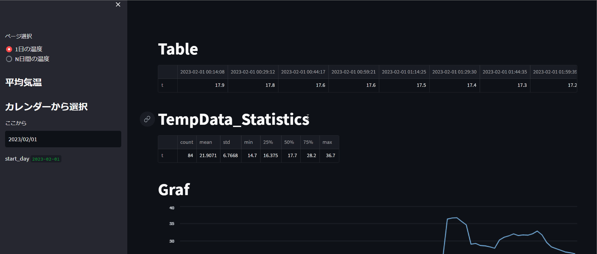

# What is "TempWeb"

本アプリは指定された日・期間の温度情報を可視化するサービスであり、温度特化型のWebアプリケーションである。

# Description

研修室で農家さんとの共同実験に今年から少しずつ参加させてもらっている。
内容はsoracomやarduinoを使用しIotで温度や湿度、二酸化炭素濃度などの様々なデータを取得できるようにセンサを配置し作成している。
その取得された値はsoracomでcsvとグラフなどでデータを可視化してくれるが情報が多く、使い慣れていないユーザーにとって親切な画面ではなかった。
そのため、今回は取得されるデータの中で温度に特化したWebアプリケーションを作成した。

今後は、湿度や二酸化炭素濃度などを可視化出来るWebアプリケーションを作成し、1つにまとめたいと考えている。
また、データをリアルタイムで取得し可視化出来るようにしたいと考えている

なお、本プロダクトの開発には、Streamlitを用いたフレームワークが採用されました。

＊公開していない

＊データは大学施設内で取得


# DEMO


作成ウェブページ



# Requirement

* Windows10 Home
* conda == 22.9.0
* conda-build == 3.22.0
* python == 3.9.13
* streamlit == 1.18.1
* pandas == 1.4.4

# Installation

[Anaconda](https://www.anaconda.com/products/distribution)のサイトのダウンロードページからWindows用のPython3.9 64bit Graphical Installerをダウンロードする(Anacondaをインストール完了することでpythonの利用可能)。

[Streamlit](https://qiita.com/tanktop-kun/items/1be2f24b9a38c76fec95)の参考サイト。

＞　Streamlitはデータに特化したPython用ウェブアプリケーション、フロントエンドの知識・経験がなくても簡単に構築できる。

```bash
pip install pandas
pip install streamlit
```

# Usage


```bash
git clone https://github.com/webtemp/~

streamlit run main.py
```

# Note

今回はcsvに2023-1-28~2023-2-3までのデータしか入っていない。

表示期間を変更するには、毎回csv取得してディレクトリに持ってきてコード内のcsv名を変えなければならい。

# Author


* Sora Nakaza
* NIT
* s202065@nishitech.ac.jp

# License

"hoge" is under [MIT license](https://en.wikipedia.org/wiki/MIT_License).
